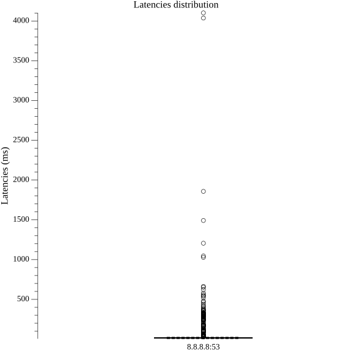
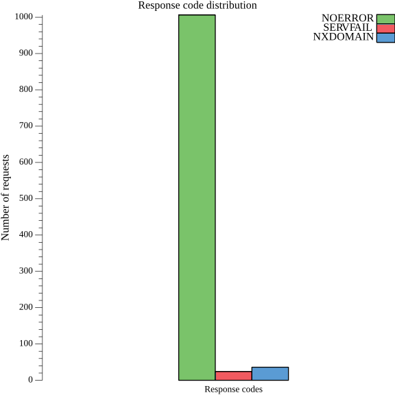

## Examples
+ [parallel benchmark with repeating queries](#parallel-benchmark-with-repeating-queries)
+ [run benchmark over specified time](#run-benchmark-over-specified-time)
+ [sending AAAA DNS queries](#sending-AAAA-DNS-queries)
+ [hostnames provided directly](#multiple-hostnames-provided-directly)
+ [hostnames provided using file](#hostnames-provided-using-file)
+ [hostnames provided using HTTP](#hostnames-provided-using-http)
+ [sending queries of multiple different query types](#sending-queries-of-multiple-different-query-types)
+ [IPv6 DNS server benchmarking](#ipv6-dns-server-benchmarking)
+ [using probability to randomize concurrent queries](#using-probability-to-randomize-concurrent-queries)
+ [EDNSOPT usage](#ednsopt-usage)
+ [DoT](#dot)
+ [DoH](#doh)
  + [DoH via GET/POST](#doh-via-getpost)
  + [DoH/1.1, DoH/2](#doh11-doh2)
+ [Plotting graphs](#plotting-graphs)


### parallel benchmark with repeating queries
this example will execute the benchmark in 10 parallel threads, where each thread will
send 2 `A example.com.` DNS queries serially to the `8.8.8.8` server
```
dnspyre -n 2 -c 10 --server 8.8.8.8 --recurse example.com
```

### run benchmark over specified time
this example will execute the benchmark in 10 parallel threads for a duration of 30 seconds while sending `A example.com` DNS queries
to the `8.8.8.8` server
```
dnspyre --duration 30s -c 10 --server 8.8.8.8 google.com
```

### sending AAAA DNS queries
```
dnspyre -n 2 -c 10 --server 8.8.8.8 -t AAAA --recurse example.com
```

### multiple hostnames provided directly
hostnames provided directly as arguments to the tool
```
dnspyre -n 10 -c 10 --server 8.8.8.8 --recurse redsift.io example.com google.com
```

### hostnames provided using file
loads hostnames from given data source file
```
dnspyre -n 10 -c 10 --server 8.8.8.8 --recurse @data/2-domains
```

### hostnames provided using HTTP
```
dnspyre -n 10 -c 10 --server 8.8.8.8 --recurse https://raw.githubusercontent.com/Tantalor93/dnspyre/master/data/2-domains
```

### sending queries of multiple different query types
this can be achieved by repeating type `-t`, all queries will be made by each specified query type
```
dnspyre -n 10 -c 10 --server 8.8.8.8 --recurse -t A -t AAAA @data/2-domains
```
together with probability option this can be used for generating arbitrary random load
```
dnspyre -n 10 -c 10 --server 8.8.8.8 --recurse -t A -t AAAA @data/2-domains --probability 0.33
```

### IPv6 DNS server benchmarking
```
dnspyre -n 10 -c 10 --server '[fddd:dddd::]:53' --recurse idnes.cz
```

### using probability to randomize concurrent queries
you can randomize queries fired by each concurrent thread by using probability lesser than 1, in this example
roughly every third hostname from datasource will be used by the single concurrent benchmark thread
```
dnspyre -c 10 --server 8.8.8.8  --recurse --probability 0.33  @data/alexa
```

### EDNSOPT usage
you can also specify EDNS option with arbitrary payload, here we are specifying EDNSOPT `65518`
coming from the local/experimental range with payload `fddddddd100000000000000000000001`
```
dnspyre -n 10 -c 10  --recurse idnes.cz --server 127.0.0.1 --ednsopt=65518:fddddddd100000000000000000000001
```

### DoT
benchmarking DoT server
```
dnspyre -n 10 -c 10  --dot --recurse  --server 1.1.1.1:853 idnes.cz
```

### DoH
benchmarking DoH server via DoH over POST method
```
dnspyre -n 200 -c 2 --server 'https://1.1.1.1/dns-query' --recurse google.com
```

#### DoH via GET/POST
you can also specify whether the DoH is done via GET or POST using `--doh-method`
```
dnspyre -c 2 --server 'https://1.1.1.1/dns-query' --doh-method get --recurse google.com
```

#### DoH/1.1, DoH/2
you can also specify whether the DoH is done over HTTP/1.1 or HTTP/2 using `--doh-protocol`
```
dnspyre -c 2 --server 'https://1.1.1.1/dns-query' --doh-protocol 2 --recurse google.com
```

### Plotting graphs
plots benchmark results as histograms, boxplots and line graphs to the new subdirectory `graphs-<current unix timestamp>` in the current directory
```
dnspyre -d 30s -c 2 --server 8.8.8.8 --plot . --recurse https://raw.githubusercontent.com/Tantalor93/dnspyre/master/data/1000-domains
```
generates graphs like these:






